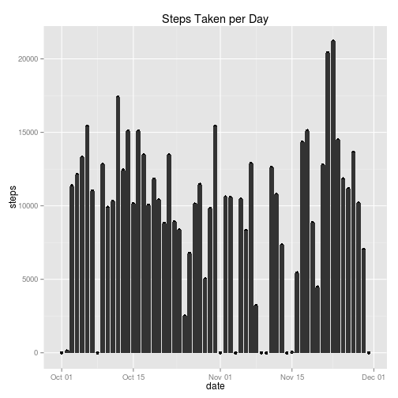
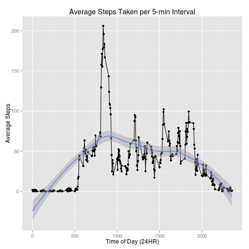
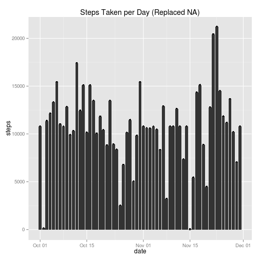
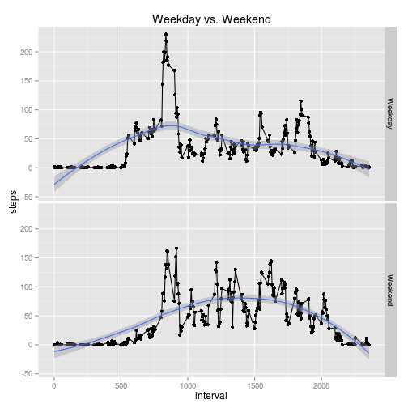

# Reproducible Research #

This report is produced for Peer Assignment 1 for the Data Science Reproducible class.  The report analyzed an anonymous volunteer's walking activity, whom wore an activity tracking device for two months in October and November, 2012. The number of steps were taken at 5-minute intervals throughout the day.

The original data set contained 3 variables: steps, date and time interval.  The initial data set could be download [here](https://d396qusza40orc.cloudfront.net/repdata%2Fdata%2Factivity.zip) for further analysis.  

## Cleaning Data ##
Since the time interval variable from the data set is a numeric vector, it is beneficial to clean the data to date variable.  The following R codes clean the data and set a new column as "datetime".

```r
myFile <- "/home/eric/Documents/Coursea/"
myFile <- paste0(myFile, "DataScience/repResearch/RepData_PeerAssessment1/")
myFile <- paste0(myFile, "activity.csv")

# Read and clean the data ####
mydata <- read.csv(myFile)
## convert the date into Date instead of factor
mydata$date <- as.Date(mydata$date)
## create a new datetime colume to track the actual time
newCol <- as.character(mydata$interval) # convert interval into text
newCol <- paste0("0000", newCol) # left pad with four 0's
newCol <- substr(newCol, nchar(newCol)-3, nchar(newCol)) # keep only the last 4
newCol <- paste0(substr(newCol,1,2), ":", substr(newCol,3,4)) # put HH:MM
newCol <- as.POSIXct(paste(mydata$date, newCol)) # combine date and time
mydata <- cbind(mydata, newCol)
names(mydata) <- c("steps", "date", "interval", "datetime")
```

## Mean Steps per Day ##
To understand the user's daily activity behavior, let's observe the overview of the two months' daily steps.  The chart below shows the daily steps taken by the user.  From observation, the average daily step taken is around 10,000 steps.

```r
## plot the histogram for steps taken per day ####
library(ggplot2)
# summarize the data at the day level
dailyStep <- aggregate(mydata$step, by=list(mydata$date), FUN=sum, na.rm=TRUE)
names(dailyStep) <- c("date", "steps")
ds <- qplot(date, steps, data=dailyStep, main="Steps Taken per Day")
ds <- ds+geom_bar(stat="identity")
ds
```

 

The exact average steps taken could be found by employing the mean and media function from R.  

```r
# calcuate the mean and median steps taken per day ####
mean(dailyStep$steps, na.rm=TRUE)
```

```
## [1] 9354
```

```r
median(dailyStep$steps, na.rm=TRUE)
```

```
## [1] 10395
```

## Daily Activity Pattern ##
To observe the user's daily activity base on hours of the day, the following chart will uses the average steps taken on a given time interval over 2-month of data to plot a time series chart.  


```r
# what is the daily pattern like on 5 min intervals ####
# plot time series on 5 min interval vs. avg steps taken
intervalAvg <- aggregate(mydata$step, by=list(mydata$interval), FUN=mean, na.rm=TRUE)
names(intervalAvg) <- c("interval", "avgInterval")
ia <- qplot(interval, avgInterval, data=intervalAvg
            , main="Average Steps Taken per 5-min Interval"
            , xlab="Time of Day (24HR)"
            , ylab="Average Steps")
ia <- ia+geom_line()
ia <- ia+geom_smooth(method="loess")
ia
```

 

The plot shows the user being most active during the morning hours between 8 and 9am.  The most active 5-minute interval could be found using the following R codes.

```r
subset(intervalAvg, avgInterval == max(intervalAvg$avgInterval), select=c(interval))
```

```
##     interval
## 104      835
```

## Missing Values ##
There are many missing values within the database.  To replace the missing values, the average steps for each interval is calculated over the 2-month period and assigned if steps are missing. 

Number of Rows with Missing Data:

```r
sum(is.na(mydata$steps))
```

```
## [1] 2304
```

The for loop cycles through every record in the dataframe and check if there is a missing record.  If the check is true, it replaces the value with the mean time interval value.

```r
# create new dataframe to track the clean data
# run for loop through the df and replace NA with interval average
mydataClean <- mydata
for (i in 1:nrow(mydataClean)) {
    if (is.na(mydataClean[i,1])){
        mydataClean[i,1] <- subset(intervalAvg, interval==mydataClean[i,3], select=c(avgInterval))
    }
}
```

Plot the histogram with the new data.

```r
# make histogram for the new data
dailyStepClean <- aggregate(mydataClean$step, by=list(mydataClean$date), FUN=sum , na.rm=TRUE)
names(dailyStepClean) <- c("date", "steps")
dsc <- qplot(date, steps, data=dailyStepClean
             , main="Steps Taken per Day (Replaced NA)")
dsc <- dsc+geom_bar(stat="identity")
dsc
```

 

Comparing the histograms, the new chart clearly shown more steps taken by the user.  The mean and median of the steps taken also shown an increase from the previous dataset.

```r
mean(dailyStepClean$steps, na.rm=TRUE)
```

```
## [1] 10766
```

```r
median(dailyStepClean$steps, na.rm=TRUE)
```

```
## [1] 10766
```

## Weekdays vs. Weekend ##
In general, a person with weekday work hours will show difference on the walking activity between weekdays and weekends.  To highlight the trend, the dates from the dataframe will be assigned a new factor column to differentiate the two categories.  

The following R code tests each row and assigns "Weekend" if the date is either Saturday or Sunday.  The rest of the dates will get a "Weekday" value.  Using the new dataset, the time interval average is calculated between the weekday and weekend categories.

```r
# what is the difference between weekday and weekend activities ####
mydataClean["weekdays"] <- NA
for (i in 1:nrow(mydataClean)){
    if (weekdays(mydataClean[i,2]) == "Saturday" |  
        weekdays(mydataClean[i,2]) == "Sunday") {
        mydataClean[i,5] <- "Weekend"
    }
    else {
        mydataClean[i,5] <- "Weekday"
    }
}
mydataClean$weekdays <- as.factor(mydataClean$weekdays)
# calculate the time interval averages
wkAvg <- aggregate(mydataClean$step, by=list(mydataClean$interval, mydataClean$weekday), FUN=mean)
names(wkAvg) <- c("interval", "weekdays", "steps")
```

Plot the time series steps taken between weekdays and weekends.

```r
wk <- qplot(interval, steps, data=wkAvg, main="Weekday vs. Weekend")
wk <- wk + geom_line()
wk <- wk + facet_grid(weekdays ~ .)
wk <- wk + geom_smooth(method="loess")
wk
```

 

On average, the user tends to perform majority of the walking exercise in the mornings during the weekdays.  The trend changes for the weekend days.  During the weekend, the user decreased the walking activities performed in the morning and have a slightly higher walking activity in the afternoons and evenings.


